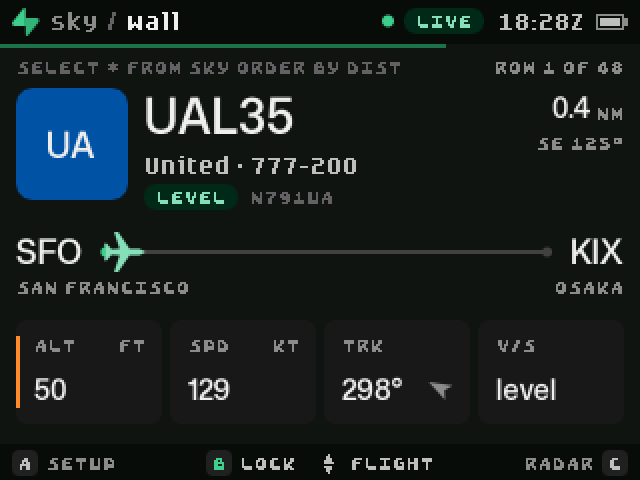
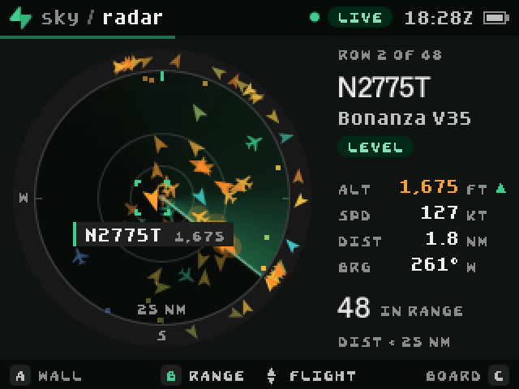
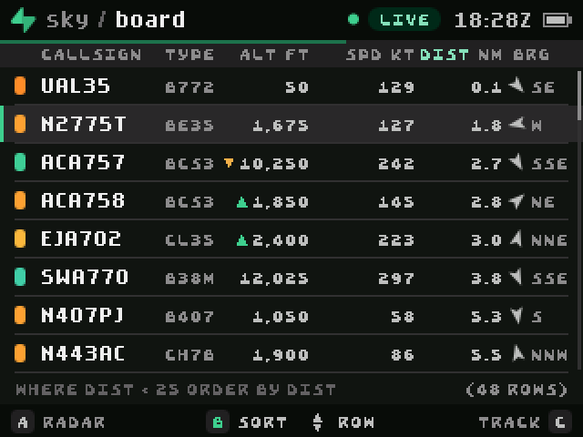
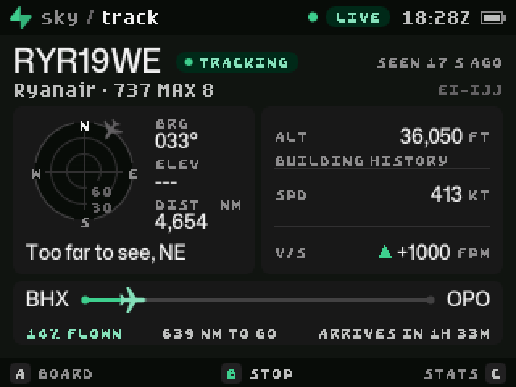
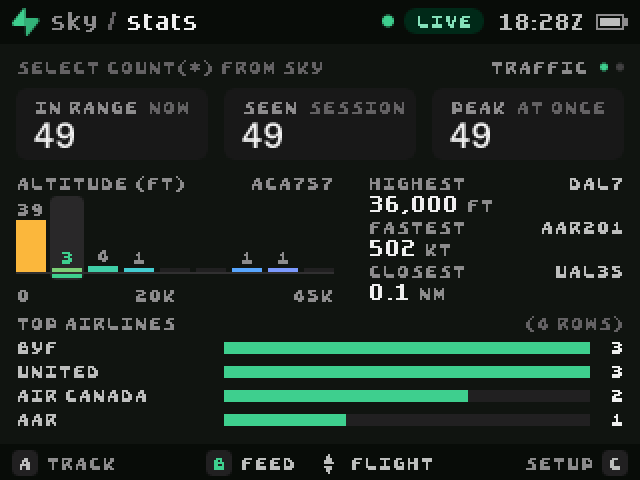
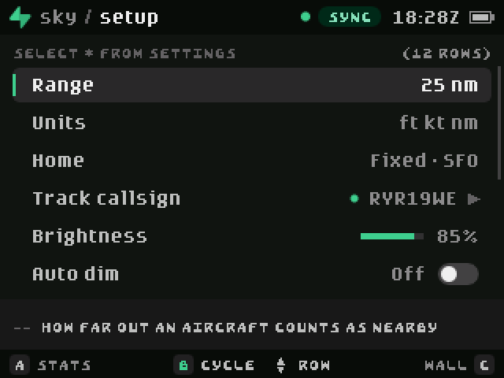

# Select Sky

`select * from sky;`


Select Sky turns the Supabase SELECT badge (a Pimoroni Tufty 2350) into a flight
wall. It shows the aircraft around you, or one callsign anywhere in the world,
across six views. It is an open-source MicroPython app, inspired by
[FlightWall](https://theflightwall.com/) and themed after Supabase.

Select Sky is unofficial. It is not for navigation.

| Wall | Radar | Board |
| --- | --- | --- |
|  |  |  |

| Track | Stats | Setup |
| --- | --- | --- |
|  |  |  |

## What it shows

| View | What you get |
| --- | --- |
| **Wall** | One aircraft as a name plate: airline tile, callsign, route with progress, altitude, speed, track and vertical speed. It cycles through the five nearest aircraft. |
| **Radar** | A scope with a rotating sweep. Aircraft sit at their true position, coloured by altitude, with trails. Traffic beyond the range shows on the rim. |
| **Board** | The sky as a table, sortable by distance, altitude, speed or callsign. |
| **Track** | Where to look for one flight: a sky dome with bearing and elevation, altitude and speed history, and route progress or closest approach. |
| **Stats** | Counts, records, an altitude histogram and top airlines for the session, plus feed details. |
| **Setup** | Range, units, home, tracked callsign, brightness, rear lights and more. |

When an aircraft sends an emergency transponder code (7500, 7600 or 7700), an
alert fills the screen and the rear lights flash until you acknowledge it.

## Controls

| Button | Action |
| --- | --- |
| **A** / **C** | Previous view / next view |
| **B** | The action named in the bottom bar: lock, range, sort, track or change |
| **UP** / **DOWN** | Select an aircraft, or move through rows |
| **HOME** | Return to the launcher |

## Hardware it uses

- **Screen:** 320 x 240, with antialiased vector type and shapes.
- **Buttons:** all five, with auto-repeat on the arrows.
- **Rear lights:** follow the radar sweep, glow as an aircraft comes close,
  blink for a new arrival and flash for an emergency code.
- **Light sensor:** Auto dim (off by default) lowers the backlight when the room
  is dark. It is experimental: see [Status](#status).
- **Battery:** shown in the top bar. The rear lights switch off below 15% on
  battery power.
- **Clock:** the top bar shows the time once a live feed or the badge clock
  supplies it.
- **Storage:** your settings persist between runs.

## Try it in the browser

1. Package the app:

   ```sh
   python3 scripts/package.py select_sky
   ```

2. Open [Make](https://badge.select/make), choose **Open file** and select
   `dist/select_sky.zip`.
3. Choose **Run**. Click the badge, then use the arrow keys, **A**, **S** (for
   B) and **D** (for C).

In the browser the app shows demo traffic around your location until you give
it a relay of your own. The chip in the top bar reads **DEMO** or **LIVE** to
tell you which one you are seeing.

## Get live aircraft

The app ships without a live source for the browser. To see real aircraft on
the virtual badge, deploy your own relay and give the app its URL.

Aircraft broadcast their position over ADS-B, and community feeds publish those
positions. The feeds do not send CORS headers, so a web page cannot read them.
The relay in this project, the Supabase Edge Function `supabase/functions/sky`,
adds the headers, trims each aircraft to the 16 values the badge draws and
caches each answer for five seconds.

1. Create a Supabase project, or pick one you already use.
2. Deploy the function to it. The function relays public data and takes no key,
   so it runs without JWT verification:

   ```sh
   supabase functions deploy sky --project-ref YOUR_PROJECT_REF --no-verify-jwt
   ```

3. Give the app your URL, in one of two ways:

   - **In Make:** after you import the ZIP, choose **Files**, open `config.py`
     and set `PROXY_URL`. The change stays in your browser.
   - **In the source:** set `PROXY_URL` in `select_sky/config.py`, then package
     the app again.

   ```python
   PROXY_URL = "https://YOUR_PROJECT_REF.supabase.co/functions/v1/sky"
   ```

4. Choose **Run**. The chip turns green and reads **LIVE**.

Before you share your copy of the app, set `PROXY_URL` back to `""`. Everyone
who runs a copy with your URL uses your relay and your Supabase quota.

A real badge on Wi-Fi does not need the relay. If `PROXY_URL` is empty or the
relay stops answering, the badge asks adsb.fi and then adsb.lol directly. If no
source answers, the app shows demo traffic and tries the live sources again
every minute.

What the relay costs you:

- One badge that polls every 12 seconds makes about 216,000 calls a month.
  Compare that with the Edge Function quota of your Supabase plan.
- Supabase can pause a Free plan project that has no database activity, and the
  relay makes no database queries. If the chip changes to **DEMO** after a quiet
  week, resume the project in the Supabase dashboard.

The function is public, so anyone with the URL can call it. It only reads two
fixed feeds and limits the radius to 100 nautical miles. It answers from a
5-second cache, serves an answer up to 60 seconds old if both feeds fail, and
returns 503 when requests for different places exceed about one upstream
request per second per instance.

The feeds ask for a contact in the User-Agent, so change `USER_AGENT` in
`index.ts` to one for your own project.

## Put it on a badge

1. Plug in the badge with a USB data cable and double-press RESET.
2. Copy the `select_sky` folder into the `apps` folder on the TUFTY drive.
3. If your badge has no Wi-Fi details yet, add them to `secrets.py` on the
   drive:

   ```python
   WIFI_SSID = "your network"
   WIFI_PASSWORD = "your password"
   ```

4. Eject the drive, press RESET and open **Select Sky** from the launcher.

The complete steps are in the
[first app guide](https://badge.select/guides/first-program).

## Settings

Change most settings on the badge in the **Setup** view. `select_sky/config.py`
holds the ones you set once:

| Setting | Purpose |
| --- | --- |
| `PROXY_URL` | URL of your own `sky` Edge Function. Empty, as shipped, means demo traffic in the browser. |
| `HOME` | `(latitude, longitude, "LABEL")` to pin where "nearby" is. `None` looks it up from your IP address. |
| `TRACK` | A callsign to follow anywhere, such as `"UAL1"`. |
| `POLL_S` | Seconds between updates. The feeds ask for 10 or more. |
| `CONTACT` | The User-Agent a real badge sends to the feeds. |
| `START_VIEW`, `SPLASH` | The first view, and whether to play the startup animation. |

## How it works

```text
select_sky/
  __init__.py     App object and frame loop
  config.py       Settings you edit
  skyfeed.py      Sources: Edge Function, direct feeds, demo. One request per frame at most
  skymodel.py     Aircraft rows, dead reckoning, selection, records, alerts
  skydemo.py      Demo traffic that crosses the sky on straight tracks
  skygeo.py       Distance, bearing, elevation
  skydata.py      Airlines, aircraft types and airports
  skyui.py        Drawing kit and the top and bottom bars
  skytheme.py     Supabase dark palette, fonts and the altitude ramp
  skyhw.py        Rear lights, light sensor, backlight and battery
  skyoverlay.py   Startup, emergency takeover, toasts and view transitions
  view_*.py       One module per view
supabase/functions/sky/index.ts   The relay
tests/test_logic.py               Desktop tests for the maths, model and feeds
tests/sim/run.mjs                 Runs the packaged app in the badge.select simulator
```

The feed reports each aircraft every 12 seconds. Between reports the model
moves each aircraft along its track at its ground speed, so the radar stays in
motion.

## Develop

```sh
python3 tests/test_logic.py              # maths, model, demo and feed parsing
python3 scripts/package.py select_sky    # builds dist/select_sky.zip
```

Packaging checks paths, encoding and size limits. It does not run the app. To
check behaviour, import the ZIP in Make and choose **Run**.

`tests/sim/run.mjs` does that for you in headless Chrome: it imports the ZIP,
presses the buttons you list and saves screenshots of the badge screen.

```sh
cd tests/sim && npm install playwright-core
node run.mjs ../../dist/select_sky.zip out "wait:6000;shot:wall;key:C;wait:2000;shot:radar"
```

To run the relay on your computer:

```sh
deno run --allow-net supabase/functions/sky/index.ts
curl 'http://localhost:8000/?lat=37.62&lon=-122.38&r=25'
```

## Data and privacy

- **Aircraft positions:** [adsb.fi](https://adsb.fi/) and
  [adsb.lol](https://adsb.lol/) (ODbL). Both are community feeds, and adsb.fi
  asks for personal, non-commercial use. Read their terms before you rely on
  them, and keep the attribution.
- **Routes:** the VRS standing data that adsb.lol hosts. A route belongs to a
  callsign, not to today's flight, so it can be wrong.
- **Location:** when `HOME` is `None`, the app sends one request to
  [ipwho.is](https://ipwho.is/) at startup to find your approximate position.
  Set `HOME` to skip that request.
- The app sends your home position to the aircraft source, rounded to four
  decimal places. The relay rounds it to two.
- Do not put passwords or service keys in the app folder. The app needs none.

## Status

Select Sky was developed and tested in the badge.select browser simulator. It
has not run on a physical badge. The code that only a real badge runs (joining
Wi-Fi and calling the feeds directly) follows the firmware source but is
untested.

On a real badge every update is a blocking request. The screen keeps its last
frame, and a button press that starts and ends during the request is lost. The
8-second timeout covers each connect and read, not the whole request, and the
DNS lookup has no timeout, so a slow or failing source can hold the screen for
longer than 8 seconds. No request has been timed on a badge.

Not verified on hardware:

- **Auto dim:** the light sensor's polarity and range are undocumented. The app
  learns the range from what it sees, so a single bright moment can leave the
  screen dimmer indoors until you relaunch. Setup shows the live reading: cover
  the sensor and check that the reading falls.
- **Direct feeds:** download time and memory for 50 to 200 KB responses.
- **Launch time and frame rate:** the badge compiles about 150 KB of source on
  every launch. If frames run slower than about 90 ms, the app turns off
  antialiasing; that threshold is untested on the device.
- **Rear lights:** their positions on the case are unknown, so the sweep follows
  them in index order.
- **SELECT's own Wi-Fi manager:** the app does not opt in to it, and how the two
  coexist is unknown.

## Starter kit files

The rest of this workspace is the badge.select starter kit. `my_badge_app/` is
its sample app, `scripts/package.py` builds the ZIP, and `AGENTS.md` and
`.agents/` guide coding agents. Those files come from badge.select, and the
license below does not cover them.

Logos, screenshots and social images are in [`branding/`](branding/README.md).

## License

MIT. See [LICENSE](LICENSE).

Supabase and the Supabase mark are trademarks of Supabase Inc. FlightWall is a
trademark of its owner. This project is not affiliated with either.
