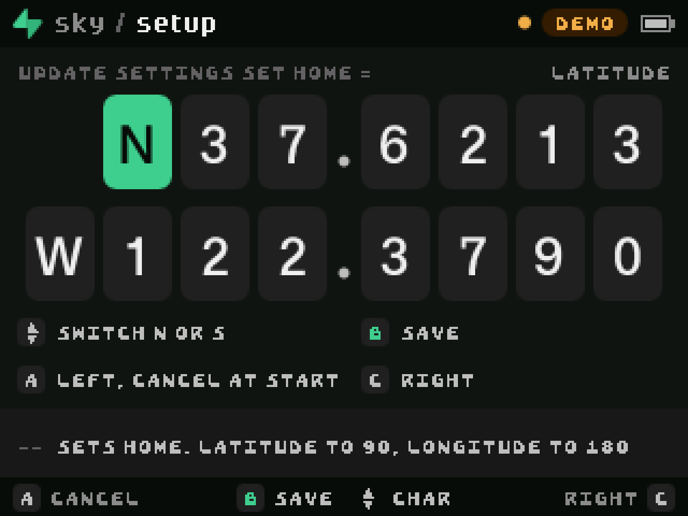
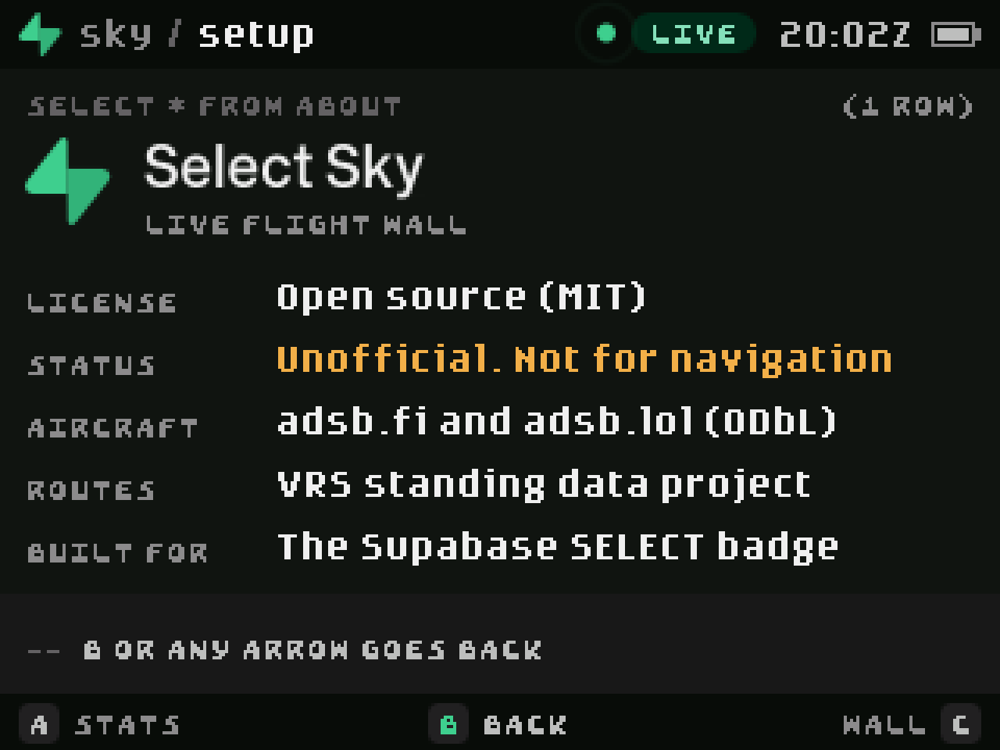
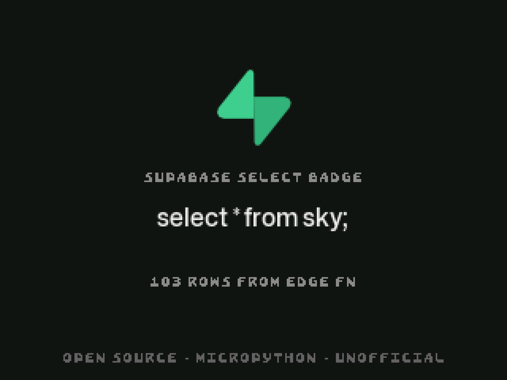
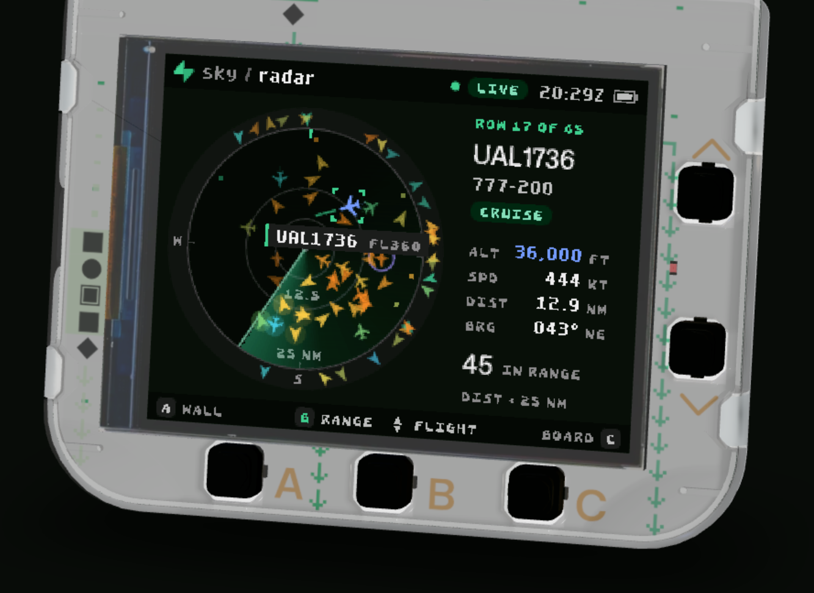
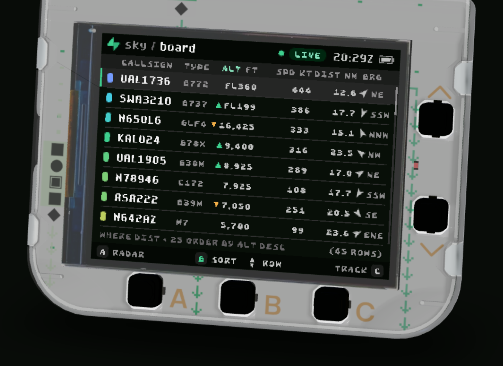
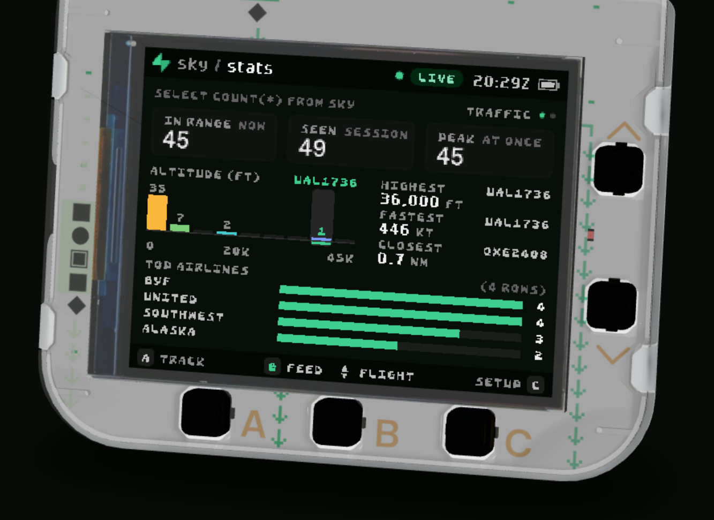

# Select Sky

`select * from sky;`


Select Sky turns the Supabase SELECT badge (a Pimoroni Tufty 2350) into a
flight wall. It shows the aircraft around you, or one flight anywhere in the
world. It is an open-source MicroPython app, inspired by
[FlightWall](https://theflightwall.com/) and themed after Supabase.

Unofficial. Not for navigation.

<p align="center">
  
  
</p>
<p align="center"><sub>3D renders from the badge.select simulator, with live traffic near San Francisco.</sub></p>

## Views

| View | What you get |
| --- | --- |
| **Wall** | One aircraft as a name plate: airline, callsign, route, altitude, speed, track and vertical speed. |
| **Radar** | A scope with a rotating sweep. Aircraft sit at their true position, colored by altitude. |
| **Board** | The sky as a table. Sort it by distance, altitude, speed or callsign. |
| **Track** | Where to look for one flight, its altitude and speed history, and its route. |
| **Stats** | Counts, records, an altitude histogram and top airlines for the session. |
| **Setup** | Range, units, your position, a callsign to follow, brightness and rear lights. |

When an aircraft sends an emergency transponder code (7500, 7600 or 7700), an
alert fills the screen and the rear lights flash until you acknowledge it.

### Every screen

<table>
<tr>
  <td align="center"><br><sub>Wall</sub></td>
  <td align="center"><br><sub>Radar</sub></td>
  <td align="center"><br><sub>Board</sub></td>
</tr>
<tr>
  <td align="center"><br><sub>Track</sub></td>
  <td align="center"><br><sub>Stats</sub></td>
  <td align="center"><br><sub>Setup</sub></td>
</tr>
<tr>
  <td align="center"><br><sub>Exact position: scan with a phone</sub></td>
  <td align="center"><br><sub>Exact position: type it</sub></td>
  <td align="center"><br><sub>Track callsign</sub></td>
</tr>
<tr>
  <td align="center"><br><sub>Squawk alert</sub></td>
  <td align="center"><br><sub>About</sub></td>
  <td align="center"><br><sub>Startup</sub></td>
</tr>
<tr>
  <td align="center"><br><sub>Paused</sub></td>
</tr>
</table>

Captures from the badge.select simulator. Each view shows live traffic near San
Francisco. The alert is the app's test alert, on demo traffic.

<p align="center">
  
  
  
</p>

## Controls

| Button | Action |
| --- | --- |
| **A** / **C** | Previous view / next view |
| **B** | The action named in the bottom bar |
| **UP** / **DOWN** | Select an aircraft, or move through rows |
| **HOME** | Return to the launcher |

## Quick start

### In the browser

1. Download [`dist/select_sky.zip`](dist/select_sky.zip).
2. Open [Make](https://badge.select/make), choose **Open file** and select the
   ZIP.
3. Choose **Run**. Click the badge, then use the arrow keys, **A**, **S** (for
   B) and **D** (for C).

The browser shows demo traffic until you add [a relay of your own](#live-aircraft).
The chip in the top bar reads **DEMO** or **LIVE**.

### On a badge

1. Plug in the badge with a USB data cable and double-press RESET.
2. Download and unzip [`dist/select_sky.zip`](dist/select_sky.zip), then copy the
   `select_sky` folder into the `apps` folder on the TUFTY drive.
3. If the badge is not on Wi-Fi yet, create `secrets.py` at the top of the
   drive:

   ```python
   WIFI_SSID = "your network"
   WIFI_PASSWORD = "your password"
   ```

4. Eject the drive, press RESET and open **Select Sky** from the launcher.

A badge on Wi-Fi shows live aircraft without a relay: it asks adsb.fi and
adsb.lol directly.

## Live aircraft

Community feeds publish aircraft positions, but they do not send CORS headers,
so a browser cannot read them. The virtual badge needs a relay. This project
includes one as a Supabase Edge Function, and you run it on your own Supabase
project.

1. Create the table the relay uses for the phone flow, then deploy the
   function:

   ```sh
   supabase db push --project-ref YOUR_PROJECT_REF
   supabase functions deploy sky --project-ref YOUR_PROJECT_REF --no-verify-jwt
   ```

2. Give the app your URL. In Make, choose **Files**, open `config.py` and set:

   ```python
   PROXY_URL = "https://YOUR_PROJECT_REF.supabase.co/functions/v1/sky"
   ```

3. Choose **Run**. The chip turns green and reads **LIVE**.

Before you share your copy of the app, set `PROXY_URL` back to `""`. Everyone
who runs a copy with your URL uses your relay and your Supabase quota.
[DETAILS.md](DETAILS.md#get-live-aircraft) covers what the relay does and what
it costs.

### Keep usage low

The relay runs only when a badge asks it for something. Nothing runs in the
background.

- **The badge pauses by itself.** With no button press for 30 minutes it shows
  **Paused** and sends nothing until you press a button. Change the delay with
  **Pause after** in Setup.
- **Switch live data off.** **Live data** in Setup, switched off, shows demo
  traffic and sends no requests.
- **Turn the relay off.** Delete the function, or pause the project in the
  Supabase dashboard:

  ```sh
  supabase functions delete sky --project-ref YOUR_PROJECT_REF
  ```

## Exact position

The badge has no GPS. Without help it takes your position from your IP
address, which is only as precise as your city. To center the radar on where
you stand:

1. On the badge, open **Setup**, pick **Exact position** and press **B**. The
   badge shows a QR code.
2. Scan the code with your phone and tap **Share my location**.

Your phone sends its position to your own relay, the badge collects it within a
few seconds, and the relay deletes it. Without a relay, the same row opens an
editor where you type the coordinates.

## Develop

```sh
python3 tests/test_logic.py              # maths, model, feeds and QR codes
python3 scripts/package.py select_sky    # builds dist/select_sky.zip
```

| Path | Contents |
| --- | --- |
| `select_sky/` | The app. `config.py` holds the settings you edit. |
| `supabase/` | The relay function and its migration. |
| `docs/index.html` | The page your phone opens to share its position. |
| `tests/` | Desktop tests, and a harness that runs the app in the badge.select simulator. |
| `branding/` | Logos, screenshots and social images. |

[DETAILS.md](DETAILS.md) has every setting, the code layout, the data and
privacy notes, and how to run the relay locally.

## Status

Select Sky was developed and tested in the badge.select simulator. It has also
run on one physical SELECT badge: it launched, joined Wi-Fi and showed live
aircraft through the relay. Parts of it are untested on hardware, including the
phone flow and calling the feeds without a relay.
[DETAILS.md](DETAILS.md#status) lists what is verified and what is not.

## Credits

- **Aircraft positions:** [adsb.fi](https://adsb.fi/) and
  [adsb.lol](https://adsb.lol/) (ODbL). Read their terms before you rely on
  them, and keep the attribution.
- **Routes:** the VRS standing data that adsb.lol hosts. A route belongs to a
  callsign, not to today's flight, so it can be wrong.
- **Starter kit:** `AGENTS.md`, `.agents/` and `scripts/` come
  from badge.select. The license below does not cover them.

## License

MIT. See [LICENSE](LICENSE).

Supabase and the Supabase mark are trademarks of Supabase Inc. FlightWall is a
trademark of its owner. This project is not affiliated with either.
