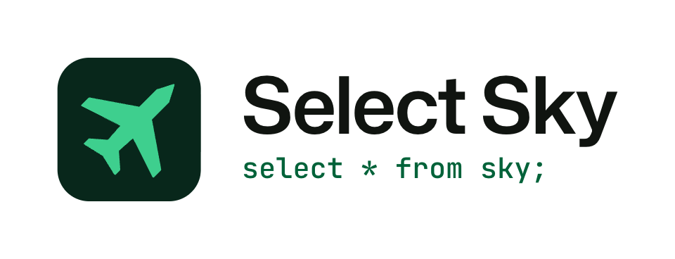

<p align="center">
  <picture>
    <source media="(prefers-color-scheme: dark)" srcset="logo/lockup-tagline-dark.png">
    
  </picture>
</p>

# Select Sky brand guide

Select Sky is a flight wall for the Supabase SELECT badge: an open-source (MIT) MicroPython app that shows the aircraft around you, or one callsign anywhere, across six views (Wall, Radar, Board, Track, Stats and Setup), with an emergency-squawk alert and rear-light effects. It was developed and tested in the badge.select simulator, it has not run on a physical badge, and it is unofficial.

Open [`index.html`](index.html) for the visual brand sheet. [`brand-sheet.png`](brand-sheet.png) is a full-page render of it.

| Item | Value |
| --- | --- |
| Name | Select Sky |
| Tagline | `select * from sky;` |
| Descriptor | A flight wall for the Supabase SELECT badge. |
| Primary color | Green `#3ECF8E` on deep dark `#080C08` |
| Type | Mona Sans for words and numbers, JetBrains Mono for the tagline, SQL and labels |
| Status line | Developed and tested in the badge.select simulator. Not run on a physical badge. Unofficial. |

## Contents

1. [Name and tagline](#name-and-tagline)
2. [The mark and lockups](#the-mark-and-lockups)
3. [Color](#color)
4. [Typography](#typography)
5. [Imagery](#imagery)
6. [Motion](#motion)
7. [Voice and tone](#voice-and-tone)
8. [Copy bank](#copy-bank)
9. [Trademark and attribution](#trademark-and-attribution)
10. [Asset index](#asset-index)

## Name and tagline

Write the product name as **Select Sky**: two words, title case. Write the tagline as `select * from sky;` in monospace, lowercase, with the semicolon.

| Write | Do not write |
| --- | --- |
| Select Sky | SelectSky, Select-Sky, SELECT SKY, Supabase Select Sky |
| `select * from sky;` | `SELECT * FROM sky`, `Select * from Sky`, the tagline without its semicolon |
| A flight wall for the Supabase SELECT badge. | The official Supabase flight tracker |
| unofficial, simulator-tested | official, certified, works on the badge |
| inspired by FlightWall | FlightWall-style, a FlightWall clone, FlightWall's logo or URL as decoration |
| #SelectBadge | #selectbadge, #Select_Badge |

Name rules:

- Use **Select Sky** in headlines, running text and image text. The app's own breadcrumb shows a lowercase `sky / radar`. That is screen text, not the name.
- Capitalize the view names: Wall, Radar, Board, Track, Stats and Setup.
- Write SELECT in capitals when it names the Supabase conference badge. Write "badge" in lowercase.
- Say "unofficial" near the name on any public page. Do not suggest that Supabase, Pimoroni or FlightWall made, tested or approved the app.

Tagline rules:

- Set the tagline in JetBrains Mono at weight 500, in green `#3ECF8E` on dark. On light backgrounds use `#006239`. In Markdown, use a code span.
- Keep it lowercase. Uppercase SQL belongs to the label style (`SELECT * FROM SKY ORDER BY DIST`), not to the tagline.
- Put it next to the name or the descriptor. It does not replace the name.
- Do not put it in quotes, translate it, explain the joke, or turn it into a sentence.

## The mark and lockups

The mark is a green (`#3ECF8E`) top-view airliner pointing up-right at 45 degrees, on a green-ink (`#08271B`) rounded-square tile. The tile radius is 22% of its edge. The glyph fills 65% of the tile and sits optically centered.

Use the PNG lockups in READMEs and documents. The SVG lockups keep live text, so they show Mona Sans and JetBrains Mono only when opened as a document or inlined with network access. Through an `` tag, or offline, they fall back to Inter or Helvetica.

### Which file for which use

| Use | File |
| --- | --- |
| App icon, avatar, social profile | `logo/icon-1024.png`, or `logo/icon.svg` for vector |
| Icon at 16 to 20 px | `logo/icon-small-16.png`, `logo/icon-small-24.png`, `logo/icon-small.svg` |
| Browser tab | `logo/favicon.ico` (16, 32 and 48 px; the 16 px frame uses the small glyph) |
| Header on a dark page | `logo/lockup-horizontal-dark.png` |
| Header on a light page | `logo/lockup-horizontal-light.png` |
| Header with the tagline | `logo/lockup-tagline-dark.png`, `logo/lockup-tagline-light.png` |
| Square or narrow space | `logo/lockup-stacked-dark.png`, `logo/lockup-stacked-light.png` |
| Glyph alone, in color | `logo/glyph.svg` |
| Glyph alone, one color | `logo/glyph-mono.svg` (takes the CSS `color`) |
| Glyph at tiny sizes | `logo/glyph-small.svg` |
| Overview for a deck or review | `logo/logo-sheet.png` |

### Clear space and minimum size

| Rule | Value |
| --- | --- |
| Clear space in lockups | Cap height of the S, which is 50% of the tile height. The lockup PNGs and SVGs include it. |
| Clear space, icon alone | 25% of the tile edge |
| Smallest icon (full glyph) | 24 px. Below that, use the small icon: the full glyph's tail drops under 1 px. |
| Smallest horizontal lockup | 112 px wide |
| Smallest stacked lockup | 64 px wide |
| Smallest tagline lockup | 200 px wide |

These sizes come from the geometry (the thinnest feature is 4.4% of the tile) and from real-size renders on `logo/logo-sheet.png`. They are not the result of user testing.

### Light and dark

- The tile is only 1.17:1 against `#101410`. On dark backgrounds the glyph carries the mark. On light backgrounds the tile does.
- On light backgrounds the wordmark is `#101410`. The tagline is `#006239` (6.5:1). The brand green `#3ECF8E` on light is 1.7:1, so do not use it for text there.
- Light lockups sit on `#EFEFEF`. The palette has no other light background.

### Do and do not

| Do | Do not |
| --- | --- |
| Use the files as exported. | Stretch, squash, rotate, outline or redraw the mark. |
| Keep the clear space. | Use colors outside the palette. |
| Tint the glyph by altitude when the glyph stands alone. | Tint the tile by altitude. |
| Place the logo on flat dark or light backgrounds. | Place it on busy photos or screenshots. |
| Leave it flat. | Add shadows or glows. |

### The Supabase bolt

The Supabase bolt is Supabase's trademark. It appears inside the product screenshots and on the boot splash, where it is the app's own theming. Do not add it to the Select Sky logo or wordmark, place it next to them, or use it as a decorative element on social cards or other artwork. Apply the same rule to any other partner mark.

## Color

The values come from [`select_sky/skytheme.py`](../select_sky/skytheme.py). Dark is the default. Green is the one brand accent. Contrast ratios use the WCAG formula, measured against `#080C08`.

| Role | Name | Hex | Use |
| --- | --- | --- | --- |
| Primary | Green | `#3ECF8E` | Glyph, tagline, LIVE dot, rising vertical speed. 9.9:1. |
| Primary | Green hi | `#85E0BA` | LIVE chip text, the route glyph. 12.5:1. |
| Primary | Green mid | `#1D724C` | Progress bars and quiet fills. |
| Primary | Green dim | `#006239` | Tagline on light backgrounds. 6.5:1 on `#EFEFEF`. |
| Primary | Green tint | `#002918` | Chip and pill backgrounds. |
| Primary | Green ink | `#08271B` | The icon tile. |
| Surface | BG deep | `#080C08` | Deepest background: sheets, social cards, the screen's outer edge. |
| Surface | BG | `#101410` | Main screen and card surface. |
| Surface | Panel | `#181818` | Stat tiles and grouped rows. |
| Surface | Raised | `#212021` | Key caps and raised rows. |
| Surface | Line | `#313031` | Dividers and rules inside screens. |
| Text | Text | `#EFEFEF` | Headlines, numbers, callsigns. 17.1:1. |
| Text | Text 2 | `#BDBEBD` | Body copy and secondary values. 10.6:1. |
| Text | Text 3 | `#8C8B8C` | Mono labels and captions. 5.8:1. |
| Status | Amber | `#F2AF48` | DEMO and STALE chips, descents, caution. 10.3:1. |
| Status | Red | `#F16A50` | Emergency squawk and alerts only. 6.5:1. |
| Status | Sky | `#52A9FF` | Cool accent and the speed history in Track. 7.9:1. |
| Status | Violet | `#9E8CFC` | Military tag and the highest altitudes. 7.1:1. |

### Altitude ramp

Aircraft take their color from altitude: warm near the ground, green in the climb, cool at cruise. The ramp blends linearly between these stops.

| Altitude | Name | Hex |
| --- | --- | --- |
| 0 kft | Orange | `#FF8C28` |
| 3 kft | Yellow | `#FACD46` |
| 9 kft | Green | `#3ECF8E` |
| 20 kft | Cyan | `#46CDEB` |
| 31 kft | Blue | `#52A9FF` |
| 42 kft and above | Violet | `#9E8CFC` |
| Ground or unknown | Text 3 | `#8C8B8C` |

Use the ramp on aircraft glyphs only. It does not belong on the tile, on text or on buttons.

### Color rules

- Use red for emergencies and nothing else.
- Use the status colors for state, not decoration.
- Keep the look flat: no outlines, no gradients on text, no drop shadows. The ramp strip in the brand sheet is the one gradient, and it shows a color scale.
- `skytheme.py` also defines low-strength tints, such as `#341C00` behind the DEMO chip and `#3B1813` behind the squawk alert. Use them as chip and alert backgrounds only.

## Typography

| Face | License | Weights | Source |
| --- | --- | --- | --- |
| Mona Sans | SIL Open Font License | 400, 500, 600 | [GitHub](https://github.com/github/mona-sans), [Google Fonts](https://fonts.google.com/specimen/Mona+Sans) |
| JetBrains Mono | SIL Open Font License | 400, 500 | [Google Fonts](https://fonts.google.com/specimen/JetBrains+Mono) |

| Where | Face | Weight | Notes |
| --- | --- | --- | --- |
| Product name, headlines | Mona Sans | 600 | Tracking -3% at large sizes. Headlines in sentence case. |
| Descriptor line | Mona Sans | 500 | `#BDBEBD` on dark. Sentence case. |
| Numbers with units (`11,500 ft`) | Mona Sans | 500 | Tabular figures. Units in the label style. |
| Body copy | Mona Sans | 400 | `#BDBEBD` or `#EFEFEF` on dark. |
| Tagline, SQL in running text | JetBrains Mono | 500 | Lowercase. No extra letter-spacing. |
| Labels, section numbers, file names | JetBrains Mono | 500 | Uppercase, 12 to 14 px, 0.16 em tracking, `#8C8B8C`. |

The uppercase mono label style is the SQL-caption voice of the screens: `SELECT * FROM SKY ORDER BY DIST`, `ROW 8 OF 11`, `ALT FT`, `01 · WALL`. Use it for small captions, not for sentences.

Load both faces from Google Fonts and keep a system fallback:

```html
<link href="https://fonts.googleapis.com/css2?family=JetBrains+Mono:wght@400;500&family=Mona+Sans:wght@200..900&display=swap" rel="stylesheet">
```

```css
--sans: "Mona Sans", "Inter", system-ui, "Helvetica Neue", Arial, sans-serif;
--mono: "JetBrains Mono", "SF Mono", ui-monospace, Menlo, Consolas, monospace;
```

The screenshots show the badge's own pixel typefaces for captions and tables. Those faces belong to the screen. Do not use them elsewhere.

## Imagery

Two kinds of image carry the brand: screens and badge renders. Both come from the badge.select simulator. Neither shows a physical badge.

### Screens

- The single-view files in `screens/` are pixel-exact captures, 1280 × 960, which is the 320 × 240 screen at 4x. `all-views.png` is a grid of the six views at exact 2x.
- Scale them by whole numbers (1x, 2x, 3x, 4x) from the native 320 × 240 with nearest-neighbor. Do not rotate, stretch, blur or recompress them.
- Keep the top bar in frame: the breadcrumb, the LIVE or DEMO chip and the clock.
- Show the LIVE or DEMO chip as captured. Do not relabel a DEMO capture as live.
- Do not fake data. Do not edit callsigns, altitudes or positions, and do not invent aircraft. Do not stitch frames from different captures into one screen image.
- Caption each image with its view name (Wall, Radar, Board, Track, Stats, Setup).
- `screens/alert.png` shows the squawk alert from the simulator. Caption it as the alert screen, not as a real emergency.
- `screens/splash.png` shows the boot screen with the in-app Supabase bolt. Use it only to show the app starting, not as artwork.

### Badge renders

- The files in `badge/` are 3D renders of the SELECT badge on its lanyard with the app on screen. Caption them "simulator render". They are not photos.
- The simulator's own controls ("2D / 3D", the expand button, "Your program is running") are cropped out, and the crops contain no painted-over pixels. Crop any further renders the same way.
- The backdrop is `#080C08`, so a render sits flush on the dark compositions.
- Use the portrait hero (`hero-radar.png`, 1600 × 2000) for posts and posters, the angled heroes for variety, and the device crops (1333 × 971) for documentation.
- The badge card, QR block and lanyard in the renders are Supabase's SELECT artwork from the simulator. Keep them as rendered. Do not add marks to them or crop them into decoration.
- Choose a render where the screen is legible and the chip reads LIVE or DEMO.
- `badge/hero-wall.png` shows flight SKW3440 with the route SFO to SFO, as captured. Prefer `badge/hero-radar.png` for public posts.
- `badge/front-wall.png` is the simulator's flat 2D view, scaled so its screen lands on an exact 3x. The screen pixels are the Wall capture at 3x.
- The social cards carry "simulator render" in their fine print. Keep that wording when you adapt a card.

Known mismatch: the stills show flight ASA923 at 14:12Z, and the hero renders and the radar loop show SKW3440 at 14:16Z. They come from different capture moments.

## Motion

| File | Size | Use |
| --- | --- | --- |
| `motion/radar-loop.gif` | 640 × 480, 36 frames, 4.0 s | One looping radar sweep. README headers and posts. |
| `motion/radar-loop-small.gif` | 320 × 240, 36 frames, 4.0 s | The same loop for narrow embeds and issue threads. |
| `motion/views-tour.gif` | 640 × 480, 30 frames, 7.2 s | A tour of all six views with a stepped wipe and a 4 px green leading edge. Launch posts. |

- Use one GIF per post. Do not change the speed.
- Two of the 36 radar frames were synthesized from the app's own sweep model, to cover an arc the capture missed. Check the loop point if you re-edit the file.
- There is no MP4 version. The tool that makes one (`ffmpeg`) was not installed when this kit was built.

## Voice and tone

Select Sky sounds like a good field guide: plain words, exact numbers, one SQL wink, and a straight account of what was tested.

**1. Plain.** Say what the app does in words a hobbyist already uses.
- Write: "Select Sky shows the aircraft near you."
- Avoid: "Select Sky delivers real-time situational awareness."

**2. Precise.** Give numbers with units. Name the views and buttons exactly.
- Write: "Radar plots each aircraft by bearing and distance, colored by altitude. Press B to change range."
- Avoid: "See everything in the sky."

**3. A little SQL-flavored.** Allow one nod per piece, usually the tagline or a caption. Do not write whole paragraphs in SQL.
- Write: "Board is the sky as a table. Sort it by distance, altitude, speed or callsign."
- Avoid: a post that is only queries.

**4. Honest about what is tested.** State where it ran and where it did not. Keep the hedge when you shorten a sentence.
- Write: "Developed and tested in the badge.select simulator. Not run on a physical badge."
- Avoid: "Works on the badge."

Also state the limits that affect people: live data needs your own Supabase Edge Function relay, and without one the browser shows demo traffic.

Writing rules: put the result first, use the active voice, keep sentences short, write headings in sentence case, use US English, and choose familiar words. Skip superlatives and absolutes ("best", "fastest", "always", "guarantee").

## Copy bank

Counts are measured on the text below. Paste as written. If you shorten a line, keep its hedge.

### One-liner

For repo taglines, bios and link previews. 8 words; limit 12.

```text
A flight wall for the Supabase SELECT badge.
```

### Short description

For listings and card text. 48 words; limit 50.

```text
Select Sky is an open-source MicroPython app that turns the Supabase SELECT badge into a flight wall. It shows the aircraft around you, or one callsign anywhere, across six views. It was developed and tested in the badge.select simulator and has not run on a physical badge. Unofficial.
```

### Long description

For a README or project page. 102 words; limit 120.

```text
Select Sky is a flight wall for the Supabase SELECT badge (a Pimoroni Tufty 2350). It shows the aircraft around you, or one callsign anywhere, across six views: Wall, Radar, Board, Track, Stats and Setup. It adds an emergency-squawk alert and rear-light effects. Live data needs your own Supabase Edge Function relay; without one, the browser shows demo traffic. Select Sky is open source (MIT), written in MicroPython and inspired by FlightWall. It was developed and tested in the badge.select simulator and has not run on a physical badge. It is unofficial: not affiliated with or endorsed by Supabase, Pimoroni or FlightWall.
```

### Feature bullets

- Six views: Wall, Radar, Board, Track, Stats and Setup.
- Shows the aircraft around you, or follows one callsign anywhere.
- A radar sweep with aircraft colored by altitude.
- An emergency-squawk alert takes over the screen.
- Rear-light effects. Not run on a physical badge.
- Live data through your own Supabase Edge Function relay, with demo traffic when there is none.

### Posts for X

Each post is 260 characters or fewer and carries #SelectBadge. The first is built around the tagline.

**1. Tagline post** (222 characters)

```text
select * from sky;

Select Sky is a flight wall for the Supabase SELECT badge: six views, a radar sweep and an emergency-squawk alert. Open source, MicroPython, built in the badge.select simulator. Unofficial. #SelectBadge
```

**2. Radar post** (194 characters)

```text
The Radar view in Select Sky: aircraft colored by altitude under a sweep that keeps turning. MIT licensed. Tested in the badge.select simulator, not on a physical badge. Unofficial. #SelectBadge
```

**3. Alert post** (214 characters)

```text
An aircraft squawks 7700 and the screen takes over in red: code, callsign, distance and altitude. That is the alert in Select Sky, an unofficial flight wall for the SELECT badge. Simulator-tested only. #SelectBadge
```

### GitHub repo

Description (113 characters; limit 120):

```text
Flight wall for the Supabase SELECT badge: six views and a radar. MicroPython, MIT. Unofficial, simulator-tested.
```

Topics (11):

```text
micropython, badgeware, tufty-2350, pimoroni, supabase, supabase-edge-functions, aircraft, flight-tracker, radar, select-badge, open-source
```

The topics name Supabase and Pimoroni only to say what the app is for. The description keeps the word "Unofficial".

### Alt text

For the five main images. Each starts with what the image is, then what it shows.

| Image | Alt text |
| --- | --- |
| `badge/hero-radar.png` | Simulator render of the Supabase SELECT badge on its lanyard, with the Select Sky Radar view on screen: a green sweep over aircraft colored by altitude. |
| `badge/hero-wall.png` | Simulator render of the SELECT badge on its lanyard, with the Select Sky Wall view on screen: callsign SKW3440, a route bar and four stat tiles. |
| `screens/all-views.png` | Six Select Sky screens in a grid, each with a LIVE chip: Wall, Radar, Board, Track, Stats and Setup, on a dark green-black background. |
| `social/og-card.png` | Select Sky logo and the tagline select * from sky; beside a simulator render of the SELECT badge running the Radar view. Open source, MicroPython, simulator render, unofficial. |
| `motion/radar-loop.gif` | Animation of one full turn of the Select Sky radar sweep over aircraft colored by altitude, with the selected flight's details beside the scope. |


## Trademark and attribution

Select Sky is unofficial. It is not affiliated with or endorsed by Supabase, Pimoroni or FlightWall.

- **Supabase.** The Supabase name, logo, bolt and the SELECT badge and conference artwork belong to Supabase. The app shows the bolt on its screens and boot splash as in-app theming. The renders in `badge/` and `social/` include Supabase's SELECT badge card and lanyard as the simulator draws them. Do not add the bolt to the Select Sky logo or social artwork, or use it as decoration. Use "Supabase SELECT badge" only to say which badge the app is for.
- **Pimoroni.** The Tufty 2350 is Pimoroni's product. Use its name only to say which hardware the SELECT badge is.
- **FlightWall.** The only permitted mention is "inspired by FlightWall". Do not use its logo, artwork or name for anything else.
- **Aircraft data.** Live data needs your own Supabase Edge Function relay. Check the terms of whichever data source your relay uses before you republish positions or routes.
- **Fonts.** Mona Sans and JetBrains Mono are licensed under the SIL Open Font License.
- **Code.** Select Sky is released under the MIT license. See [`LICENSE`](../LICENSE). The license file does not say whether it also covers the files in this folder, so confirm before reusing them outside the project.
- **Status line.** Public pages should carry this line or a shorter form that keeps all three facts: developed and tested in the badge.select simulator; not run on a physical badge; unofficial. Image cards with a badge render carry "simulator render" and "unofficial" in their fine print. The post or page that holds the card carries the full line.

## Asset index

Paths are relative to this folder. Sizes are pixels (viewBox for SVG) and file weight.

| Path | Size | Use |
| --- | --- | --- |
| `logo/favicon.ico` | 16/32/48 px · 2 KB | Favicon (16 px frame uses the small glyph) |
| `logo/glyph-mono.svg` | viewBox 720 × 720 · 491 B | One-color glyph; takes the CSS color |
| `logo/glyph-small.svg` | viewBox 720 × 720 · 490 B | Simplified glyph for tiny sizes |
| `logo/glyph.svg` | viewBox 720 × 720 · 470 B | Green glyph, transparent background |
| `logo/icon-1024.png` | 1024 × 1024 · 20 KB | Master icon export |
| `logo/icon-192.png` | 192 × 192 · 3 KB | Master icon export |
| `logo/icon-32.png` | 32 × 32 · 569 B | Master icon export |
| `logo/icon-512.png` | 512 × 512 · 9 KB | Master icon export |
| `logo/icon-64.png` | 64 × 64 · 1021 B | Master icon export |
| `logo/icon-small-16.png` | 16 × 16 · 330 B | Small-glyph icon where detail collapses |
| `logo/icon-small-24.png` | 24 × 24 · 499 B | Small-glyph icon, optional heavier 24 px |
| `logo/icon-small.svg` | viewBox 1024 × 1024 · 548 B | Simplified icon for 16 to 20 px |
| `logo/icon.svg` | viewBox 1024 × 1024 · 528 B | Master rounded-tile icon, vector |
| `logo/lockup-horizontal-dark.png` | 960 × 344 · 18 KB | Horizontal lockup for dark pages (2x) |
| `logo/lockup-horizontal-dark.svg` | viewBox 815.26 × 292.13 · 989 B | Tile and wordmark, light text. Live text |
| `logo/lockup-horizontal-light.png` | 960 × 344 · 19 KB | Horizontal lockup for light pages (2x) |
| `logo/lockup-horizontal-light.svg` | viewBox 815.26 × 292.13 · 989 B | Tile and wordmark, dark text. Live text |
| `logo/lockup-stacked-dark.png` | 960 × 786 · 27 KB | Stacked lockup for dark pages (2x) |
| `logo/lockup-stacked-dark.svg` | viewBox 619.88 × 507.53 · 989 B | Icon above wordmark, for dark. Live text |
| `logo/lockup-stacked-light.png` | 960 × 786 · 27 KB | Stacked lockup for light pages (2x) |
| `logo/lockup-stacked-light.svg` | viewBox 619.88 × 507.53 · 989 B | Icon above wordmark, for light. Live text |
| `logo/lockup-tagline-dark.png` | 960 × 368 · 22 KB | Lockup with tagline for dark pages (2x) |
| `logo/lockup-tagline-dark.svg` | viewBox 856.48 × 328.32 · 1 KB | Wordmark with tagline, for dark. Live text |
| `logo/lockup-tagline-light.png` | 960 × 368 · 22 KB | Lockup with tagline for light pages (2x) |
| `logo/lockup-tagline-light.svg` | viewBox 856.48 × 328.32 · 1 KB | Wordmark with tagline, for light. Live text |
| `logo/logo-sheet.png` | 2000 × 1200 · 228 KB | Logo system overview: sizes, clear space, do not |
| `screens/alert.png` | 1280 × 960 · 16 KB | Squawk alert capture; caption it as the alert screen |
| `screens/all-views.png` | 2400 × 1400 · 102 KB | 3 × 2 grid of the six views |
| `screens/board.png` | 1280 × 960 · 10 KB | Board view capture |
| `screens/radar.png` | 1280 × 960 · 32 KB | Radar view capture |
| `screens/setup.png` | 1280 × 960 · 7 KB | Setup view capture |
| `screens/splash.png` | 1280 × 960 · 9 KB | Boot splash capture; shows the in-app Supabase bolt |
| `screens/stats.png` | 1280 × 960 · 9 KB | Stats view capture |
| `screens/track.png` | 1280 × 960 · 28 KB | Track view capture |
| `screens/wall.png` | 1280 × 960 · 23 KB | Wall view capture |
| `badge/device-board.png` | 1333 × 971 · 328 KB | Tight device crop, Board view |
| `badge/device-radar.png` | 1333 × 971 · 347 KB | Tight device crop, Radar view |
| `badge/device-setup.png` | 1333 × 971 · 288 KB | Tight device crop, Setup view |
| `badge/device-stats.png` | 1333 × 971 · 308 KB | Tight device crop, Stats view |
| `badge/device-track.png` | 1333 × 971 · 343 KB | Tight device crop, Track view |
| `badge/device-wall.png` | 1333 × 971 · 331 KB | Tight device crop, Wall view |
| `badge/front-wall.png` | 1548 × 1234 · 219 KB | Flat front view, Wall view, screen at exact 3x |
| `badge/hero-radar-left.png` | 1600 × 2000 · 566 KB | Angled hero, Radar view, turned left |
| `badge/hero-radar-right.png` | 1600 × 2000 · 482 KB | Angled hero, Radar view, turned right |
| `badge/hero-radar.png` | 1600 × 2000 · 560 KB | Portrait hero: badge on lanyard, Radar view |
| `badge/hero-wall.png` | 1600 × 2000 · 555 KB | Portrait hero, Wall view; route reads SFO to SFO |
| `social/contest-card.png` | 1600 × 900 · 266 KB | Contest card with #SelectBadge |
| `social/og-card.png` | 1200 × 630 · 176 KB | Open Graph card for link previews |
| `social/readme-banner.png` | 1600 × 520 · 73 KB | README banner: logo, tagline, two screens |
| `social/square.png` | 1080 × 1080 · 211 KB | Square post: centered badge and tagline |
| `social/x-post.png` | 1600 × 900 · 272 KB | X post card: hero, tagline, two screens |
| `motion/radar-loop-small.gif` | 320 × 240 · 303 KB | Half-size radar loop for embeds |
| `motion/radar-loop.gif` | 640 × 480 · 684 KB | Looping one-sweep radar loop, 4.0 s |
| `motion/views-tour.gif` | 640 × 480 · 513 KB | Six-view tour, 7.2 s |
| `README.md` | single file · 26 KB | This brand guide |
| `index.html` | single file · 48 KB | Single-file brand sheet; opens from disk |
| `brand-sheet.png` | 1600 × 14625 · 2343 KB | Full-page render of index.html (1600 px wide) |
